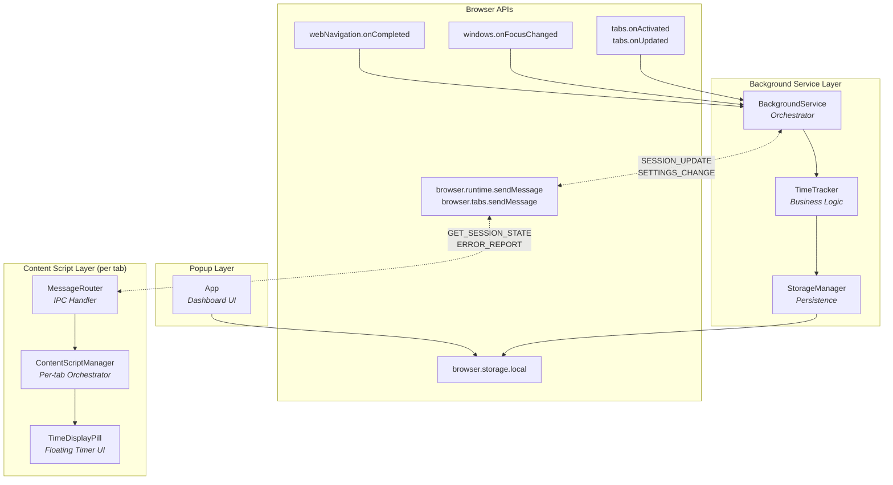
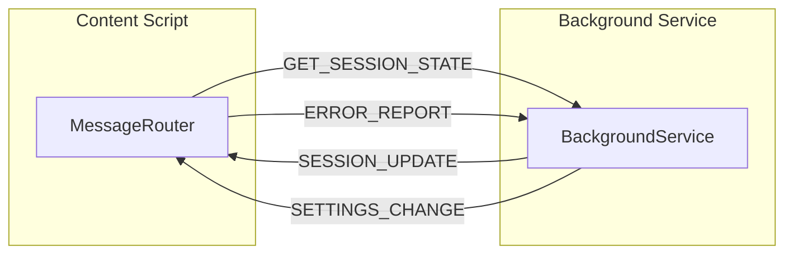

# Web Time Tracker - Component Architecture

This document describes the major components of the Web Time Tracker extension and their interactions.

## Component Diagram



## Component Descriptions

### Background Service Layer

| Component | File | Purpose |
|-----------|------|---------|
| **BackgroundService** | [src/background/background.ts](../src/background/background.ts) | Main orchestrator that registers browser event listeners, handles message passing from content scripts, and coordinates session lifecycle |
| **TimeTracker** | [src/background/services/TimeTracker.ts](../src/background/services/TimeTracker.ts) | Core business logic for starting/stopping/pausing sessions, extracting domains from URLs, and calculating session durations |
| **StorageManager** | [src/background/models/StorageManager.ts](../src/background/models/StorageManager.ts) | Type-safe abstraction over `browser.storage.local` with domain data, active session, and settings management |

### Content Script Layer

| Component | File | Purpose |
|-----------|------|---------|
| **ContentScriptManager** | [src/content/ContentScriptManager.ts](../src/content/ContentScriptManager.ts) | Per-tab singleton that manages component lifecycle, handles URL changes (SPA support), and broadcasts updates to UI components |
| **MessageRouter** | [src/content/messaging/MessageRouter.ts](../src/content/messaging/MessageRouter.ts) | Implements `MessageSender` interface for IPC with background service, handles incoming messages and routes to registered handlers |
| **TimeDisplayPill** | [src/content/components/TimeDisplayPill.tsx](../src/content/components/TimeDisplayPill.tsx) | Preact component in Shadow DOM displaying elapsed session time, supports drag positioning and pause/inactive states |

### Popup Layer

| Component | File | Purpose |
|-----------|------|---------|
| **App** | [src/popup/App.tsx](../src/popup/App.tsx) | Dashboard showing current session info and today's total time, polls storage directly for live updates |

---

## Message Protocol

Messages flow between Background and Content Script layers via `browser.runtime.sendMessage` and `browser.tabs.sendMessage`.



### Message Types

| Message | Direction | Payload |
|---------|-----------|---------|
| `GET_SESSION_STATE` | Content → Background | `{ domain: string }` |
| `SESSION_UPDATE` | Background → Content | `{ domain, currentTime, isActive, isPaused, startTime }` |
| `SETTINGS_CHANGE` | Background → Content | `{ pillPosition, pillVisibility, excludedDomains }` |
| `ERROR_REPORT` | Content → Background | `{ error, context, stackTrace? }` |

### Base Message Interface

```typescript
interface ExtensionMessage {
  type: string;
  payload: unknown;
  id: string;        // Auto-generated unique ID
  timestamp: number; // Message creation time
}

interface MessageResponse<T = unknown> {
  success: boolean;
  data?: T;
  error?: string;
}
```

---

## Component Interfaces

### StorageManager

```typescript
class StorageManager {
  // Singleton
  static getInstance(storage?: StorageArea): StorageManager
  static resetInstance(): void

  // Core CRUD
  get<K extends keyof StorageSchema>(keys: K | K[]): Promise<Partial<Pick<StorageSchema, K>>>
  set<K extends keyof StorageSchema>(items: Partial<Pick<StorageSchema, K>>): Promise<void>
  remove(keys: keyof StorageSchema | (keyof StorageSchema)[]): Promise<void>
  clear(): Promise<void>
  getAll(): Promise<StorageSchema>
  initialize(): Promise<void>

  // Domain operations
  getDomainData(domain: string): Promise<DomainData>
  updateDomainData(domain: string, updates: Partial<DomainData>): Promise<void>

  // Session operations
  getActiveSession(): Promise<ActiveSession | null>
  setActiveSession(session: ActiveSession | null): Promise<void>

  // Settings operations
  getSettings(): Promise<ExtensionSettings>
  updateSettings(updates: Partial<ExtensionSettings>): Promise<void>
}
```

### TimeTracker

```typescript
class TimeTracker {
  // Singleton
  static getInstance(storageManager?: StorageManager): TimeTracker
  static resetInstance(): void

  // Domain/URL utilities
  extractDomain(url: string): string

  // Duration calculation
  calculateDuration(startTime: number, endTime?: number): number
  getSessionDuration(session: ActiveSession): number

  // Session lifecycle
  startSession(domain: string, tabId: number, windowId: number): Promise<ActiveSession>
  stopSession(): Promise<Session | null>
  pauseSession(): Promise<ActiveSession | null>
  resumeSession(): Promise<ActiveSession | null>
  getCurrentSession(): Promise<ActiveSession | null>
}
```

### BackgroundService

```typescript
class BackgroundService {
  // Singleton
  static getInstance(storageManager?: StorageManager, timeTracker?: TimeTracker): BackgroundService
  static resetInstance(): void

  // Lifecycle
  initialize(): Promise<void>
  isInitialized(): boolean
  shutdown(): Promise<void>

  // Session access
  getCurrentSession(): Promise<ActiveSession | null>

  // Event handlers (private)
  // handleTabActivated(activeInfo: { tabId, windowId })
  // handleTabUpdated(tabId, changeInfo, tab)
  // handleWindowFocusChanged(windowId)
  // handleNavigationCompleted(details: { tabId, frameId, url })
  // handleMessage(message, sender, sendResponse)
}
```

### MessageRouter

```typescript
class MessageRouter implements MessageSender {
  // Lifecycle
  initialize(): void
  destroy(): void

  // Handler registration
  registerHandler<T extends ExtensionMessage>(messageType: string, handler: MessageHandler<T>): void
  unregisterHandler(messageType: string): void

  // Message sending
  sendMessage<T extends ExtensionMessage>(message: Omit<T, "id" | "timestamp">): Promise<MessageResponse>
  requestSessionState(domain: string): Promise<MessageResponse>
  reportError(error: string, context: string, stackTrace?: string): Promise<void>
}
```

### ContentScriptManager

```typescript
class ContentScriptManager {
  // Singleton
  static getInstance(): ContentScriptManager
  static resetInstance(): void

  // Lifecycle
  initialize(): Promise<void>
  isReady(): boolean
  destroy(): void

  // Domain management
  getDomain(): string
  handleUrlChange(newUrl: string): void

  // Component registry
  registerComponent(name: string, component: any): void
  getComponent<T = any>(name: string): T | null
  unregisterComponent(componentName: string): void

  // Message router access
  getMessageRouter(): MessageRouter
}
```

### TimeDisplayPill

```typescript
class TimeDisplayPill {
  constructor()  // Auto-mounts to DOM in Shadow DOM

  // ContentScriptManager broadcast handlers
  onSessionUpdate(state: SessionState | null): void
  onSettingsChange(settings: Partial<ExtensionSettings>): void

  // Position persistence
  setPositionChangeCallback(callback: (position: PillPosition) => void): void

  // Cleanup
  destroy(): void
}

interface SessionState {
  domain: string;
  currentTime: number;  // elapsed milliseconds
  isActive: boolean;
  isPaused: boolean;
  startTime: number;    // performance.now() value
}
```

---

## Data Types

### Core Types

```typescript
interface ActiveSession {
  domain: string;
  startTime: number;     // performance.now() timestamp
  tabId: number;
  windowId: number;
  isPaused?: boolean;
}

interface Session {
  startTime: number;
  endTime?: number;
  duration: number;      // milliseconds
  tabId: number;
  windowId: number;
}

interface DomainData {
  totalTime: number;                    // total ms spent on domain
  sessions: Session[];                  // completed sessions
  dailyStats: Record<string, number>;   // "YYYY-MM-DD" → milliseconds
  lastAccessed: number;                 // timestamp
}

interface ExtensionSettings {
  pillPosition: PillPosition;
  pillVisibility: boolean;
  dataRetentionDays: number;
  excludedDomains: string[];
}

interface PillPosition {
  x: number;
  y: number;
}
```

### Storage Schema

```typescript
interface StorageSchema {
  domains: Record<string, DomainData>;
  activeSession: ActiveSession | null;
  settings: ExtensionSettings;
  version: number;      // For data migration
  installDate: number;  // First install timestamp
}
```

---

## Design Patterns

| Pattern | Usage |
|---------|-------|
| **Singleton** | BackgroundService, TimeTracker, StorageManager, ContentScriptManager (one instance per context) |
| **Observer/Pub-Sub** | MessageRouter broadcasts to registered handlers, ContentScriptManager broadcasts to components |
| **Repository** | StorageManager abstracts browser.storage.local with type-safe API |
| **Adapter** | TimeTracker adapts duration calculation and domain extraction |
