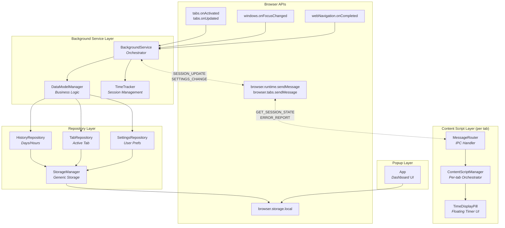
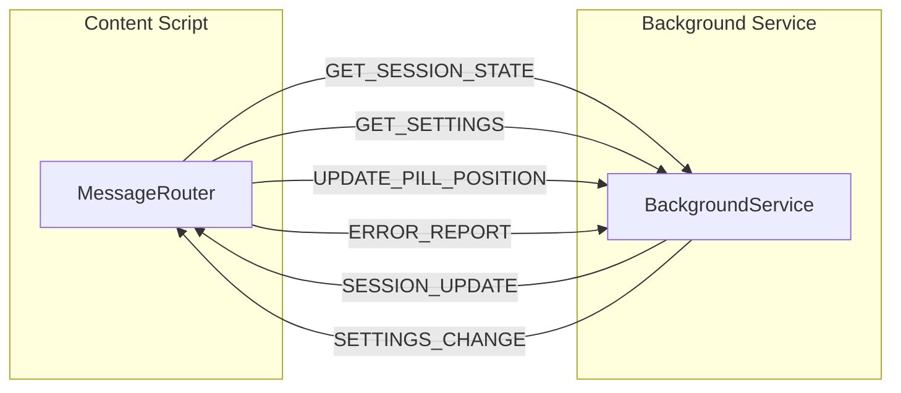

# Web Time Tracker - Component Architecture

This document describes the major components of the Web Time Tracker extension and their interactions.

## Component Diagram



## Component Descriptions

### Background Service Layer

| Component | File | Purpose |
|-----------|------|---------|
| **BackgroundService** | [src/background/background.ts](../src/background/background.ts) | Main orchestrator that registers browser event listeners, handles message passing from content scripts, and coordinates session lifecycle |
| **DataModelManager** | [src/background/services/DataModelManager.ts](../src/background/services/DataModelManager.ts) | Business logic for time tracking: handles lifecycle events (TabEnter, TabExit, HourElapsed, DayElapsed), manages active tab state, and coordinates with repositories for data persistence |
| **TimeTracker** | [src/background/services/TimeTracker.ts](../src/background/services/TimeTracker.ts) | Session management for starting/stopping/pausing sessions, extracting domains from URLs, and calculating session durations |

### Repository Layer

| Component | File | Purpose |
|-----------|------|---------|
| **HistoryRepository** | [src/background/repositories/HistoryRepository.ts](../src/background/repositories/HistoryRepository.ts) | Data access for History, Day, and Hour records. Manages per-day storage keys (`day_YYYY-MM-DD`), hour-level aggregations, and data retention cleanup |
| **TabRepository** | [src/background/repositories/TabRepository.ts](../src/background/repositories/TabRepository.ts) | Data access for ActiveTab state. Manages the currently tracked domain with totalTime, visit timestamps, and timer checkpoints |
| **SettingsRepository** | [src/background/repositories/SettingsRepository.ts](../src/background/repositories/SettingsRepository.ts) | Data access for ExtensionSettings. Manages user preferences including pill position, visibility, retention days, and excluded domains |
| **StorageManager** | [src/background/models/StorageManager.ts](../src/background/models/StorageManager.ts) | Generic type-safe abstraction over `browser.storage.local` used by repositories |

### Content Script Layer

| Component | File | Purpose |
|-----------|------|---------|
| **ContentScriptManager** | [src/content/ContentScriptManager.ts](../src/content/ContentScriptManager.ts) | Per-tab singleton that manages component lifecycle, handles URL changes (SPA support), and broadcasts updates to UI components |
| **MessageRouter** | [src/content/messaging/MessageRouter.ts](../src/content/messaging/MessageRouter.ts) | Implements `MessageSender` interface for IPC with background service, handles incoming messages and routes to registered handlers |
| **TimeDisplayPill** | [src/content/components/TimeDisplayPill.tsx](../src/content/components/TimeDisplayPill.tsx) | Preact component in Shadow DOM displaying elapsed session time, supports drag positioning and pause/inactive states |

### Popup Layer

| Component | File | Purpose |
|-----------|------|---------|
| **App** | [src/popup/App.tsx](../src/popup/App.tsx) | Dashboard showing current session info and today's total time, polls storage directly for live updates |

---

## Message Protocol

Messages flow between Background and Content Script layers via `browser.runtime.sendMessage` and `browser.tabs.sendMessage`.

> **Architecture Decision:** Settings are delivered using a **push-based model** for reliability. See [ADR-0001: Push-Based Settings](adr/0001-push-based-settings.md) for rationale.



### Message Types

| Message | Direction | Payload | Description |
|---------|-----------|---------|-------------|
| `GET_SESSION_STATE` | Content → Background | `{ domain: string }` | Request current session for domain |
| `GET_SETTINGS` | Content → Background | `{}` | Request initial settings on load |
| `UPDATE_PILL_POSITION` | Content → Background | `{ position: PillPosition, source: PositionChangeSource }` | Report pill position change |
| `SESSION_UPDATE` | Background → Content | `SessionStatePayload` | Push session state to content script |
| `SETTINGS_CHANGE` | Background → Content | `{ pillPosition?, pillVisibility?, excludedDomains? }` | Push settings changes (cross-tab sync) |
| `ERROR_REPORT` | Content → Background | `{ error, context, stackTrace? }` | Report content script errors |

### Position Change Source

The `UPDATE_PILL_POSITION` message includes a `source` discriminator to control broadcast behavior:

| Source | Trigger | Background Action |
|--------|---------|-------------------|
| `user_drag` | User drags the pill | Save position, broadcast `SETTINGS_CHANGE` to other tabs |
| `window_resize` | Viewport bounds changed | Save position only (no broadcast) |

### Base Message Interface

```typescript
interface ExtensionMessage {
  type: string;
  payload: unknown;
  id: string;        // Auto-generated unique ID
  timestamp: number; // Message creation time
}

interface MessageResponse<T = unknown> {
  success: boolean;
  data?: T;
  error?: string;
}

// Shared session state payload
interface SessionStatePayload {
  domain: string;
  currentTime: number;  // elapsed milliseconds
  isActive: boolean;
  isPaused: boolean;
  startTime: number;    // performance.now() value
}

type PositionChangeSource = "user_drag" | "window_resize";
```

---

## Component Interfaces

### StorageManager

```typescript
class StorageManager {
  // Singleton
  static getInstance(storage?: StorageArea): StorageManager
  static resetInstance(): void

  // Core CRUD
  get<K extends keyof StorageSchema>(keys: K | K[]): Promise<Partial<Pick<StorageSchema, K>>>
  set<K extends keyof StorageSchema>(items: Partial<Pick<StorageSchema, K>>): Promise<void>
  remove(keys: keyof StorageSchema | (keyof StorageSchema)[]): Promise<void>
  clear(): Promise<void>
  getAll(): Promise<StorageSchema>
  initialize(): Promise<void>

  // Domain operations
  getDomainData(domain: string): Promise<DomainData>
  updateDomainData(domain: string, updates: Partial<DomainData>): Promise<void>

  // Session operations
  getActiveSession(): Promise<ActiveSession | null>
  setActiveSession(session: ActiveSession | null): Promise<void>

  // Settings operations
  getSettings(): Promise<ExtensionSettings>
  updateSettings(updates: Partial<ExtensionSettings>): Promise<void>
}
```

### TimeTracker

```typescript
class TimeTracker {
  // Singleton
  static getInstance(storageManager?: StorageManager): TimeTracker
  static resetInstance(): void

  // Domain/URL utilities
  extractDomain(url: string): string

  // Duration calculation
  calculateDuration(startTime: number, endTime?: number): number
  getSessionDuration(session: ActiveSession): number

  // Session lifecycle
  startSession(domain: string, tabId: number, windowId: number): Promise<ActiveSession>
  stopSession(): Promise<Session | null>
  pauseSession(): Promise<ActiveSession | null>
  resumeSession(): Promise<ActiveSession | null>
  getCurrentSession(): Promise<ActiveSession | null>
}
```

### DataModelManager

```typescript
class DataModelManager {
  // Singleton
  static getInstance(
    historyRepository?: HistoryRepository,
    tabRepository?: TabRepository,
    settingsRepository?: SettingsRepository
  ): DataModelManager
  static resetInstance(): void

  // Lifecycle
  initialize(): Promise<void>

  // Lifecycle event handlers
  handleTabEnter(context: LifecycleEventContext): Promise<ActiveTab>
  handleTabExit(): Promise<void>
  handleHourElapsed(): Promise<void>
  handleDayElapsed(): Promise<void>

  // Session control
  pauseSession(): Promise<ActiveTab | null>
  resumeSession(): Promise<ActiveTab | null>

  // State access
  getCurrentDisplayTime(): number
  getActiveTab(): ActiveTab | null
  isDomainExcluded(domain: string): Promise<boolean>
}
```

### HistoryRepository

```typescript
class HistoryRepository {
  // Singleton
  static getInstance(storage?: StorageArea): HistoryRepository
  static resetInstance(): void

  // History metadata
  getHistory(): Promise<History>
  setHistory(history: History): Promise<void>

  // Day operations
  getDay(dateKey: string): Promise<Day | null>
  setDay(dateKey: string, day: Day): Promise<void>
  deleteDay(dateKey: string): Promise<void>
  getDaysInRange(startDate: string, endDate: string): Promise<Record<string, Day>>

  // Data retention
  clearExpiredDays(retentionDays: number): Promise<number>

  // Factory methods
  createEmptyDay(timestamp: number): Day

  // Utilities (deprecated - use dateUtils)
  static getDateKey(timestamp: number): string
  static getMidnightTimestamp(timestamp: number): number
}
```

### TabRepository

```typescript
class TabRepository {
  // Singleton
  static getInstance(storage?: StorageArea): TabRepository
  static resetInstance(): void

  // Active tab state
  getActiveTab(): Promise<ActiveTab | null>
  setActiveTab(tab: ActiveTab | null): Promise<void>

  // Factory method
  static createActiveTab(domain: string, totalTime?: number): ActiveTab
}
```

### SettingsRepository

```typescript
class SettingsRepository {
  // Singleton
  static getInstance(storage?: StorageArea): SettingsRepository
  static resetInstance(): void

  // Settings operations
  getSettings(): Promise<ExtensionSettings>
  updateSettings(updates: Partial<ExtensionSettings>): Promise<void>
  setSettings(settings: ExtensionSettings): Promise<void>
  getDefaultSettings(): ExtensionSettings

  // Domain exclusion helpers
  isDomainExcluded(domain: string): Promise<boolean>
  addExcludedDomain(domain: string): Promise<void>
  removeExcludedDomain(domain: string): Promise<void>
}
```

### BackgroundService

```typescript
class BackgroundService {
  // Singleton
  static getInstance(storageManager?: StorageManager, timeTracker?: TimeTracker): BackgroundService
  static resetInstance(): void

  // Lifecycle
  initialize(): Promise<void>
  isInitialized(): boolean
  shutdown(): Promise<void>

  // Session access
  getCurrentSession(): Promise<ActiveSession | null>

  // Settings broadcast (called when position changes via user_drag)
  broadcastSettingsChange(excludeTabId?: number): Promise<void>

  // Event handlers (private)
  // handleTabActivated(activeInfo: { tabId, windowId })
  // handleTabUpdated(tabId, changeInfo, tab)
  // handleWindowFocusChanged(windowId)
  // handleNavigationCompleted(details: { tabId, frameId, url })
  // handleMessage(message, sender, sendResponse)
}
```

**Message Handlers:**

| Message Type | Handler Action |
|--------------|----------------|
| `GET_SESSION_STATE` | Return current session if domain matches |
| `GET_SETTINGS` | Return current extension settings |
| `UPDATE_PILL_POSITION` | Save position; if `source === "user_drag"`, broadcast to other tabs |
| `ERROR_REPORT` | Log error with context |

**Broadcast Behavior:**

When session updates are sent (tab activation, navigation, etc.), the background also pushes current settings via `SETTINGS_CHANGE` to ensure content scripts have fresh settings without needing to request them.

### MessageRouter

```typescript
class MessageRouter implements MessageSender {
  // Lifecycle
  initialize(): void
  destroy(): void

  // Handler registration
  registerHandler<T extends ExtensionMessage>(messageType: string, handler: MessageHandler<T>): void
  unregisterHandler(messageType: string): void

  // Message sending
  sendMessage<T extends ExtensionMessage>(message: Omit<T, "id" | "timestamp">): Promise<MessageResponse>
  requestSessionState(domain: string): Promise<MessageResponse>
  reportError(error: string, context: string, stackTrace?: string): Promise<void>
}
```

### ContentScriptManager

```typescript
class ContentScriptManager {
  // Singleton
  static getInstance(): ContentScriptManager
  static resetInstance(): void

  // Lifecycle
  initialize(): Promise<void>
  isReady(): boolean
  destroy(): void

  // Domain management
  getDomain(): string
  handleUrlChange(newUrl: string): void

  // Component registry
  registerComponent(name: string, component: any): void
  getComponent<T = any>(name: string): T | null
  unregisterComponent(componentName: string): void

  // Message router access
  getMessageRouter(): MessageRouter

  // Error reporting
  reportError(context: string, error: Error): Promise<void>
}
```

**Initialization Sequence:**

1. Wait for `DOMContentLoaded`
2. Initialize `MessageRouter` and register handlers for `SESSION_UPDATE`, `SETTINGS_CHANGE`
3. Create and register `TimeDisplayPill` component
4. Request initial session state with **exponential backoff retry** (max 5 attempts)
5. Setup visibility change handler for tab reactivation

**Resilience Features:**

- Exponential backoff retry (100ms × 2^attempt) for background connection issues
- `AbortController` support for cancellation during retries
- Visibility-based reconnection when tab becomes visible

### TimeDisplayPill

```typescript
class TimeDisplayPill {
  constructor()  // Auto-mounts to DOM in closed Shadow DOM

  // ContentScriptManager broadcast handlers
  onSessionUpdate(state: SessionState | null): void
  onSettingsChange(settings: Partial<ExtensionSettings>): void

  // Position persistence (includes source for broadcast control)
  setPositionChangeCallback(callback: (position: PillPosition, source: PositionChangeSource) => void): void

  // Cleanup
  destroy(): void
}

interface SessionState {
  domain: string;
  currentTime: number;  // elapsed milliseconds
  isActive: boolean;
  isPaused: boolean;
  startTime: number;    // performance.now() value
}

// Internal component state
interface PillState {
  sessionState: SessionState | null;
  position: PillPosition;
  visible: boolean;
  isConnecting: boolean;  // true while awaiting initial session state
}
```

---

## Data Types

### Core Types (V2)

```typescript
interface ActiveTab {
  domain: string;
  totalTime: number;       // Accumulated time for this domain today (ms)
  active: boolean;
  lastActivated: number;   // Timestamp when domain became active
  lastTimerCheck: number;  // Checkpoint for hour/day boundary handling
}

interface HourDomainData {
  totalTime: number;       // ms
  visitCount: number;
}

interface HourData {
  domains: Record<string, HourDomainData>;
}

interface DayDomainData {
  totalTime: number;       // ms
  visitCount: number;
  lastVisited: number;     // timestamp
  lastTimerCheck: number;  // timestamp
}

interface Day {
  totalTime: number;       // Total time across all domains for this day (ms)
  hours: HourData[];       // Index 0-23
  domains: Record<string, DayDomainData>;
  timestamp: number;       // Midnight timestamp (used to track time shifts)
  shiftedHours: Record<string, HourData>; // Key: "hour,shift" for time-shift handling
}

interface History {
  earliest: number;        // Timestamp of earliest day
  latest: number;          // Timestamp of latest day
  days: Record<string, Day>; // Key: "YYYY-MM-DD" format
}

interface ExtensionSettings {
  pillPosition: PillPosition;
  pillVisibility: boolean;
  dataRetentionDays: number;
  excludedDomains: string[];
}

interface PillPosition {
  x: number;
  y: number;
}

interface LifecycleEventContext {
  timestamp: number;
  domain: string;
  tabId: number;
  windowId: number;
}

type LifecycleEventType =
  | "TAB_ENTER"
  | "TAB_EXIT"
  | "SECOND_ELAPSED"
  | "HOUR_ELAPSED"
  | "DAY_ELAPSED"
  | "TIME_CHANGED";
```

### Storage Schema (V2)

```typescript
interface StorageSchemaV2 {
  activeTab: ActiveTab | null;
  history: History;
  settings: ExtensionSettings;
  version: number;
  installDate: number;
}

// Storage keys:
// - "activeTab"          → ActiveTab state
// - "history"            → History metadata
// - "day_YYYY-MM-DD"     → Individual Day records
// - "settings"           → ExtensionSettings
```

---

## Design Patterns

| Pattern | Usage |
|---------|-------|
| **Singleton** | BackgroundService, DataModelManager, TimeTracker, all Repositories, ContentScriptManager (one instance per context) |
| **Repository** | HistoryRepository, TabRepository, SettingsRepository provide domain-specific data access over generic StorageManager |
| **Observer/Pub-Sub** | MessageRouter broadcasts to registered handlers, ContentScriptManager broadcasts to components |
| **Service Layer** | DataModelManager encapsulates business logic and lifecycle events, coordinating between repositories |
| **Adapter** | TimeTracker adapts duration calculation and domain extraction |

### Layered Architecture

```
┌─────────────────────────────────────┐
│  Presentation (Content Scripts)     │
├─────────────────────────────────────┤
│  Orchestration (BackgroundService)  │
├─────────────────────────────────────┤
│  Business Logic (DataModelManager)  │
├─────────────────────────────────────┤
│  Data Access (Repositories)         │
├─────────────────────────────────────┤
│  Persistence (StorageManager)       │
├─────────────────────────────────────┤
│  Storage (browser.storage.local)    │
└─────────────────────────────────────┘
```
