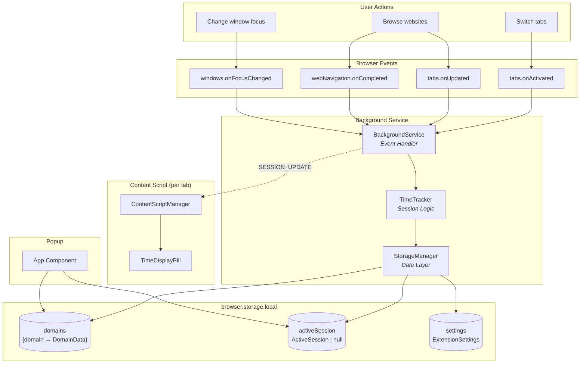
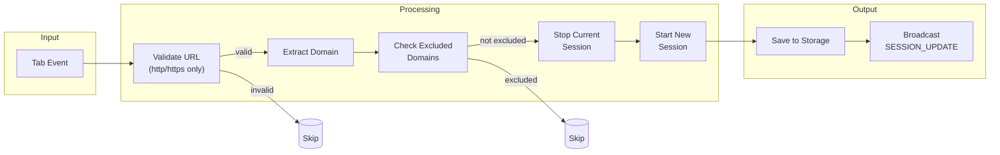
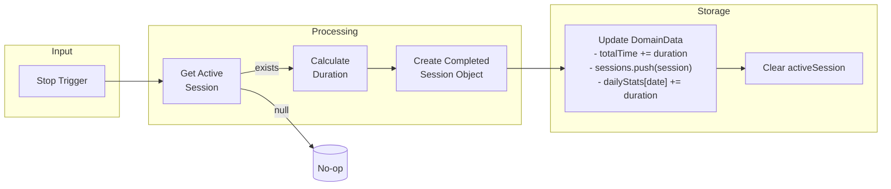
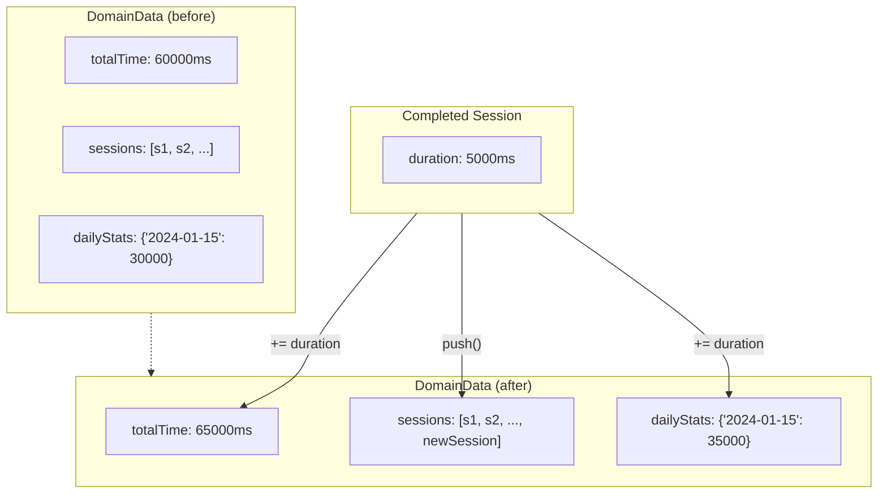
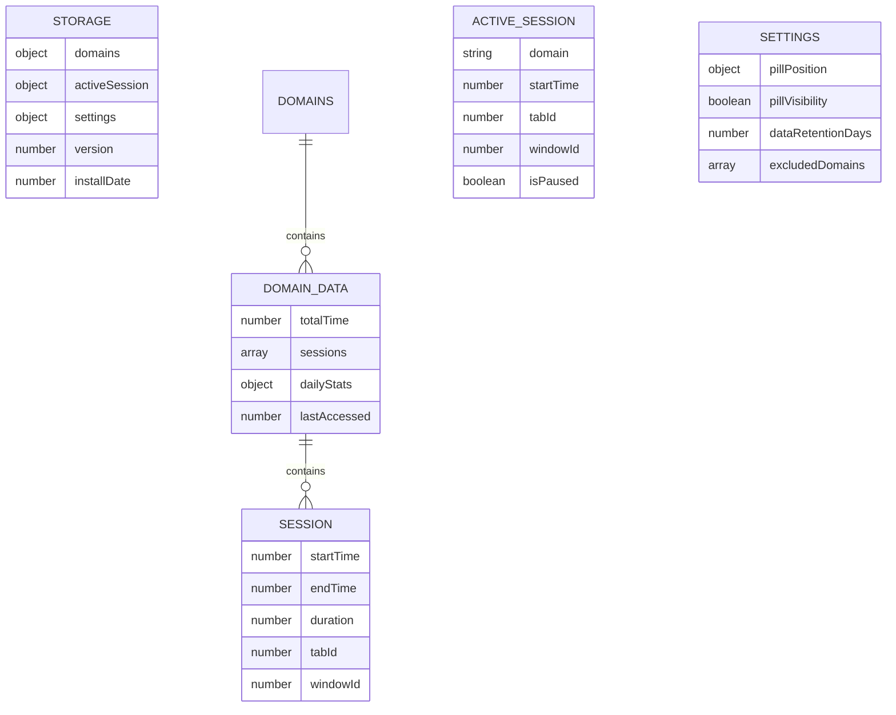
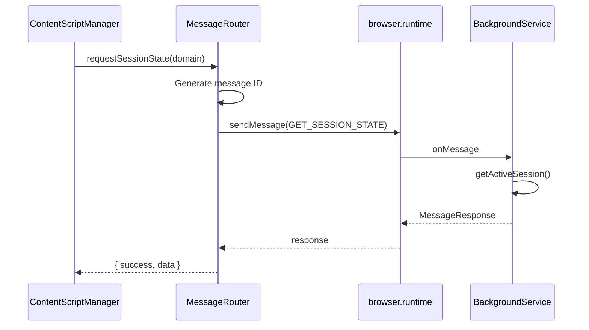
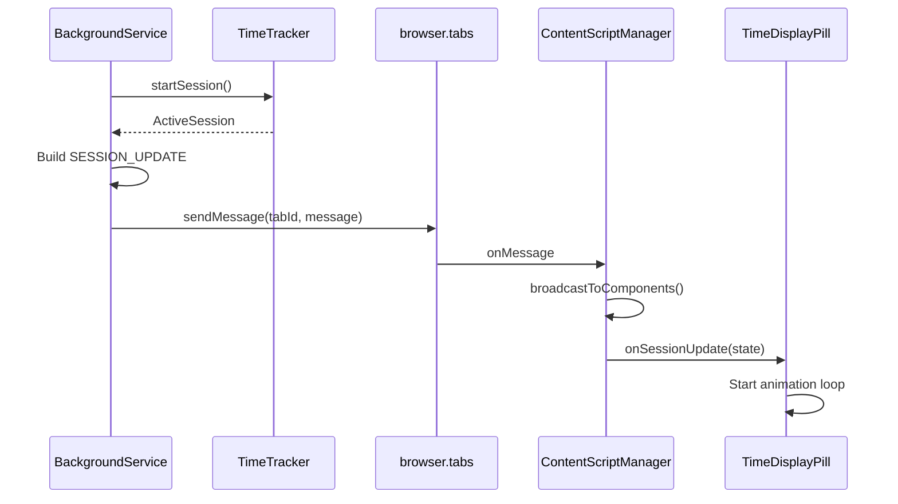
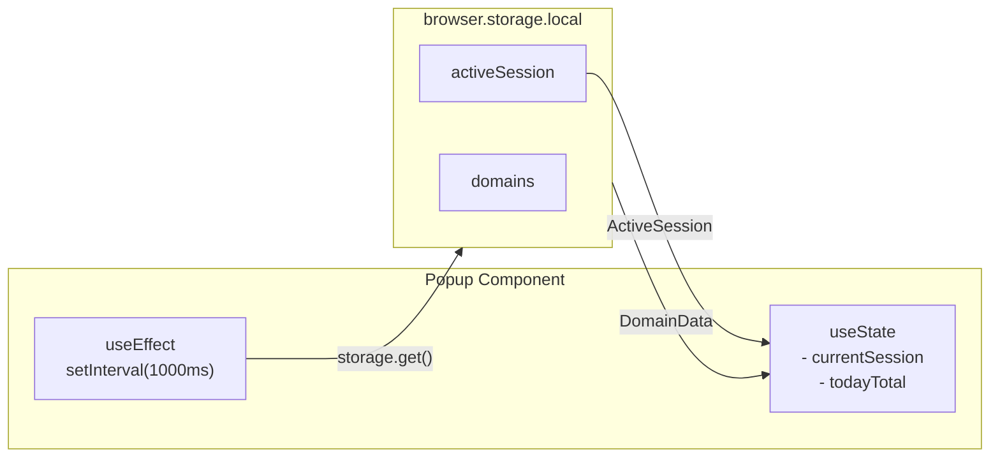

# Web Time Tracker - Data Flow

This document describes how data flows through the Web Time Tracker extension.

## High-Level Data Flow

---

## Session Start Flow

When a user navigates to a new page or switches tabs:

---

## Session Stop Flow

When stopping a session (due to tab switch, navigation, or shutdown):

---

## Domain Data Accumulation

Each domain maintains aggregated statistics:

---

## Storage Schema

---

## Message Flow

### Content Script → Background

### Background → Content Script

---

## Data Lifecycle

| Phase | Location | Data | Description |
|-------|----------|------|-------------|
| **Active** | Memory + Storage | `ActiveSession` | Currently tracking session with `startTime` |
| **Completed** | Storage | `Session` | Finished session with calculated `duration` |
| **Aggregated** | Storage | `DomainData` | Accumulated stats per domain |
| **Displayed** | UI | `SessionState` | Current elapsed time for display |

---

## Timing Precision

- **startTime**: Uses `performance.now()` for sub-millisecond precision
- **duration**: Calculated as `endTime - startTime`
- **currentTime**: Updated via `requestAnimationFrame` in TimeDisplayPill
- **dailyStats**: Keyed by ISO date string (`YYYY-MM-DD`)

---

## Popup Data Access

The popup reads storage directly (no message passing):

