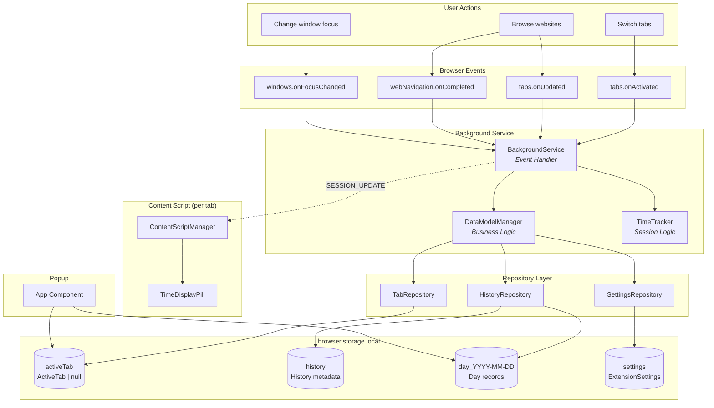
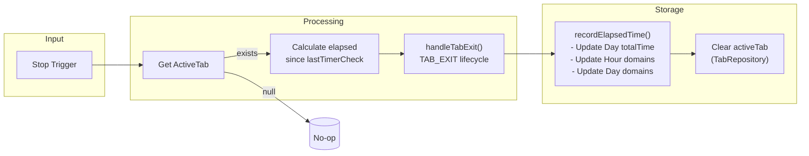
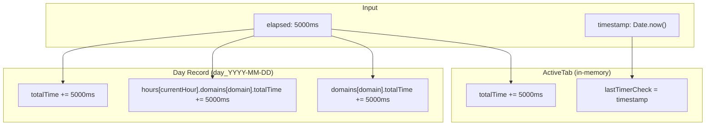
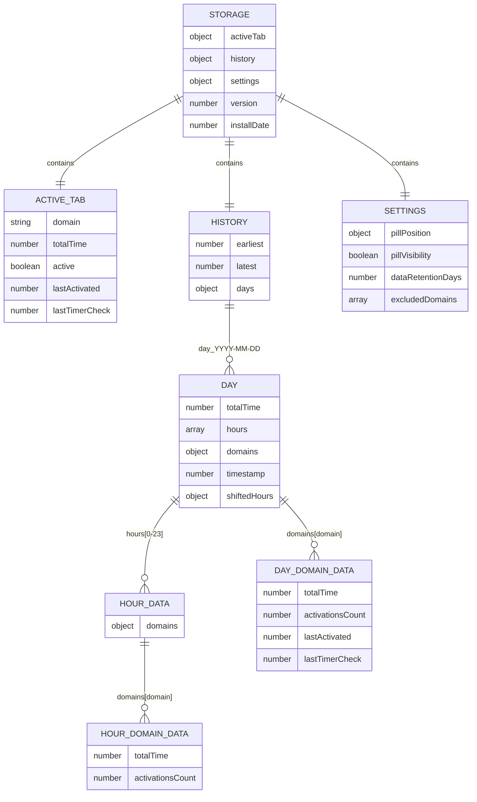
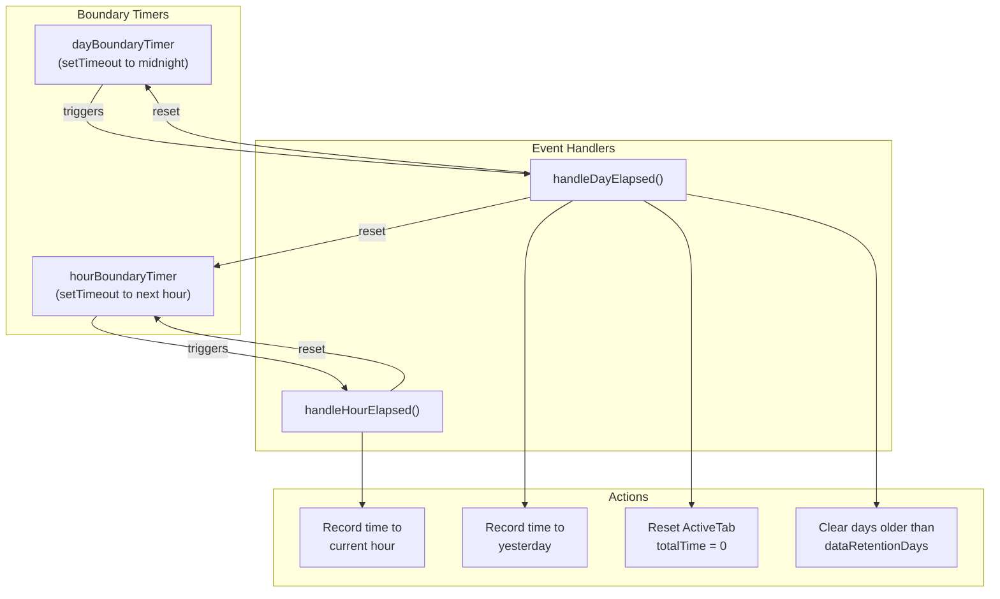
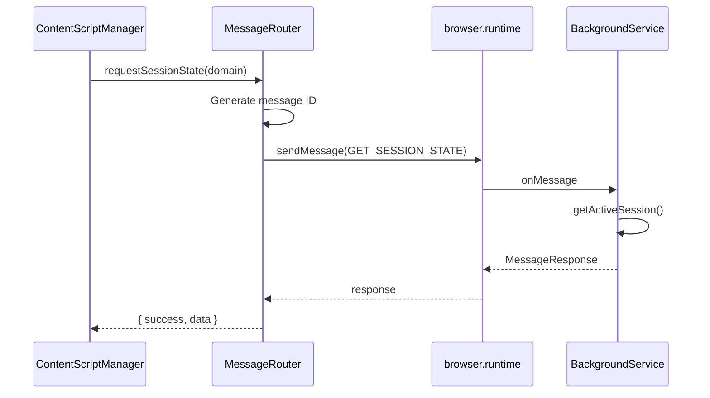
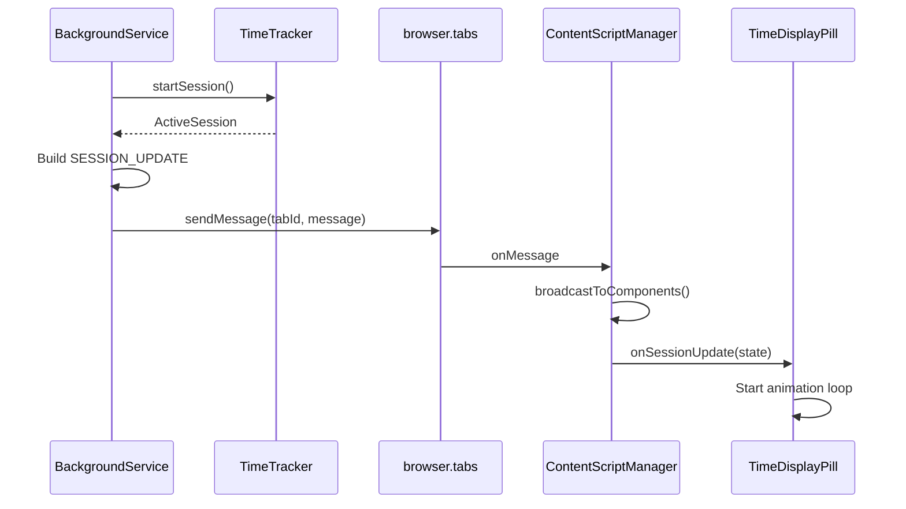
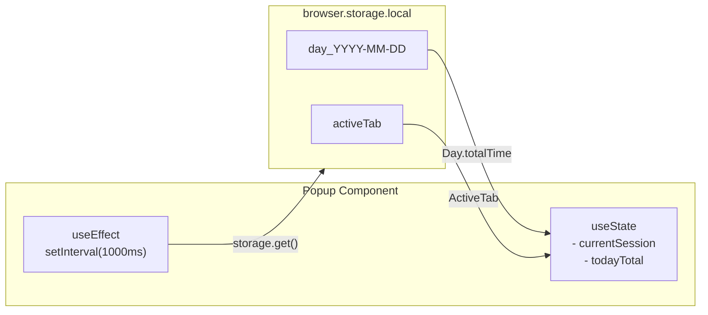

# Web Time Tracker - Data Flow

This document describes how data flows through the Web Time Tracker extension.

## High-Level Data Flow



---

## Session Start Flow (TAB_ENTER)

When a user navigates to a new page or switches tabs:

```mermaid
flowchart LR
    subgraph Input
        event["Tab Event"]
    end

    subgraph Processing
        validate["Validate URL<br/>(http/https only)"]
        extract["Extract Domain"]
        checkExcluded["Check Excluded<br/>Domains"]
        tabExit["handleTabExit()<br/>(if domain changed)"]
        tabEnter["handleTabEnter()<br/>TAB_ENTER lifecycle"]
    end

    subgraph Storage
        getToday["Get/Create Today's<br/>Day record"]
        createActiveTab["Create ActiveTab<br/>with accumulated time"]
        updateDomain["Increment domain<br/>activation count"]
    end

    subgraph Output
        persist["Persist to<br/>TabRepository"]
        broadcast["Broadcast<br/>SESSION_UPDATE"]
    end

    event --> validate
    validate -->|valid| extract
    validate -->|invalid| X1[("Skip")]
    extract --> checkExcluded
    checkExcluded -->|not excluded| tabExit
    checkExcluded -->|excluded| X2[("Skip")]
    tabExit --> tabEnter
    tabEnter --> getToday
    getToday --> createActiveTab
    createActiveTab --> updateDomain
    updateDomain --> persist
    persist --> broadcast
```



---

## Session Stop Flow (TAB_EXIT)

When stopping a session (due to tab switch, navigation, or shutdown):



---

## Time Recording Flow

When elapsed time is recorded (during TAB_EXIT, HOUR_ELAPSED, or DAY_ELAPSED):



### Data Hierarchy

```
History (metadata)
└── days: Record<"YYYY-MM-DD", Day>
    └── Day
        ├── totalTime (all domains this day)
        ├── hours[0-23]: HourData[]
        │   └── domains: Record<domain, HourDomainData>
        │       ├── totalTime
        │       └── activationsCount
        └── domains: Record<domain, DayDomainData>
            ├── totalTime
            ├── activationsCount
            ├── lastActivated
            └── lastTimerCheck
```

---

## Storage Schema (V2)



### Storage Keys

| Key Pattern | Type | Description |
|-------------|------|-------------|
| `activeTab` | `ActiveTab \| null` | Current domain tracking state |
| `history` | `History` | Metadata: earliest/latest timestamps, day references |
| `day_YYYY-MM-DD` | `Day` | Per-day records with hourly breakdowns |
| `settings` | `ExtensionSettings` | User preferences |

---

## Lifecycle Events

The `DataModelManager` handles these lifecycle events:

| Event | Trigger | Action |
|-------|---------|--------|
| `TAB_ENTER` | User navigates to a new domain | Exit previous tab, create/restore ActiveTab for domain, increment activation count |
| `TAB_EXIT` | User leaves current domain | Record elapsed time, clear ActiveTab |
| `HOUR_ELAPSED` | Clock crosses hour boundary | Record elapsed time to current hour, reset timer checkpoint |
| `DAY_ELAPSED` | Clock crosses midnight | Record remaining time to yesterday, reset ActiveTab for new day, clear expired days |

### Boundary Detection



---

## Shared Utilities

Date operations are centralized in `src/shared/dateUtils.ts`:

| Function | Purpose |
|----------|---------|
| `getDateKey(timestamp)` | Returns `YYYY-MM-DD` format (local timezone) |
| `getMidnightTimestamp(timestamp)` | Returns timestamp of midnight (00:00:00.000) |
| `getDayStorageKey(timestamp)` | Returns storage key `day_YYYY-MM-DD` |

All date operations use **local timezone** to match user expectations.

---

## Message Flow

### Content Script → Background



### Background → Content Script



---

## Data Lifecycle

| Phase | Location | Data | Description |
|-------|----------|------|-------------|
| **Active** | Memory + Storage | `ActiveTab` | Currently tracking domain with accumulated `totalTime` |
| **Recorded** | Storage | `Day.hours[h].domains[d]` | Hour-level time aggregation |
| **Aggregated** | Storage | `Day.domains[d]` | Day-level time aggregation |
| **Historical** | Storage | `History.days` | Multi-day tracking with retention |
| **Displayed** | UI | `SessionState` | Current elapsed time for display |

---

## Timing Precision

- **lastTimerCheck**: Uses `Date.now()` for checkpoint tracking
- **totalTime**: Calculated as `totalTime + (now - lastTimerCheck)` when active
- **currentTime**: Updated via `requestAnimationFrame` in TimeDisplayPill
- **Day records**: Keyed by ISO date string (`YYYY-MM-DD`)
- **Hour records**: Indexed 0-23 within each Day

---

## Popup Data Access

The popup reads storage directly (no message passing):


