# Web Time Tracker - Sequence Diagrams

This document shows the detailed sequence of events for key operations in the Web Time Tracker extension.

## Tab Load / Navigation (TAB_ENTER)

When a user navigates to a new page or activates a tab:

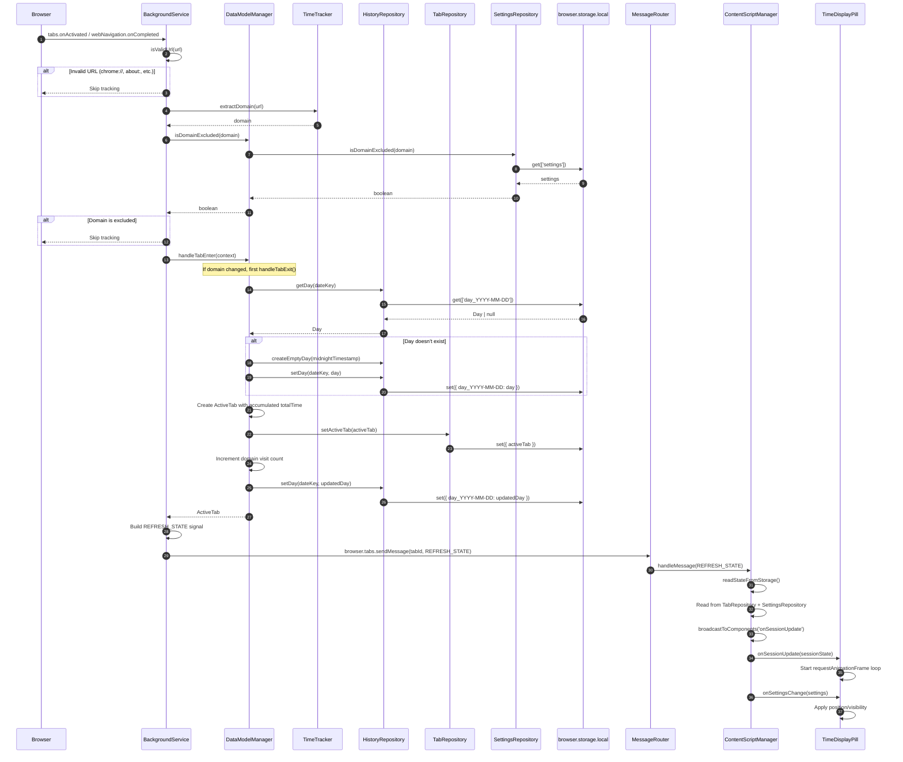

---

## Tab Unload / Page Navigation Away

When a user navigates away or closes a tab:

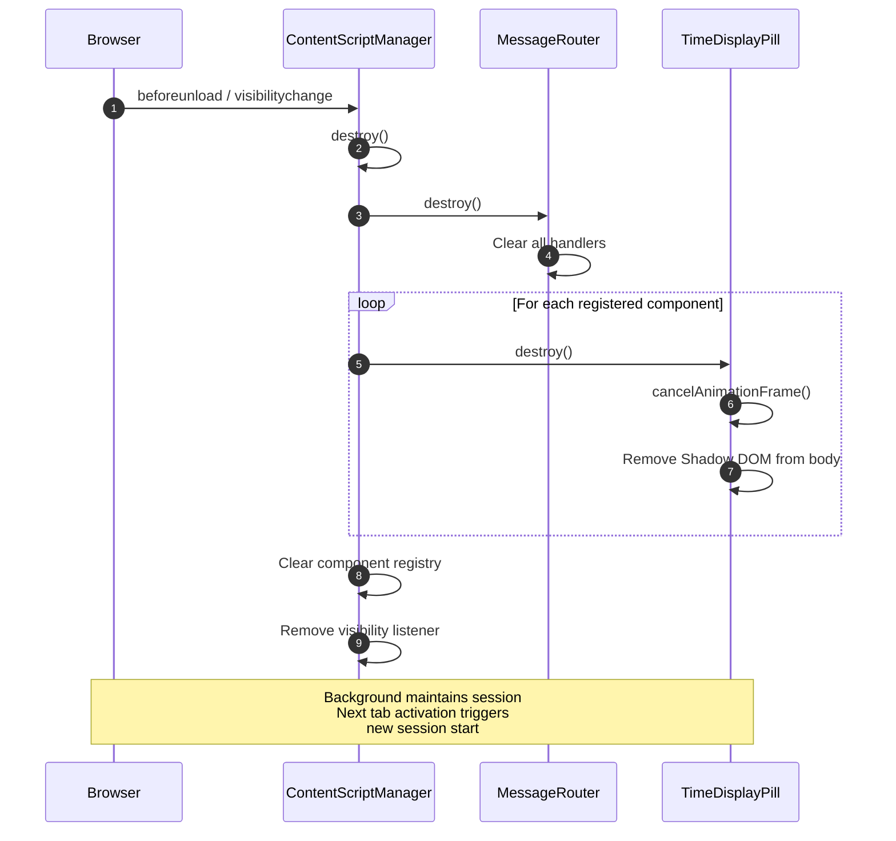

---

## Window Focus Change

When the browser window gains or loses focus:

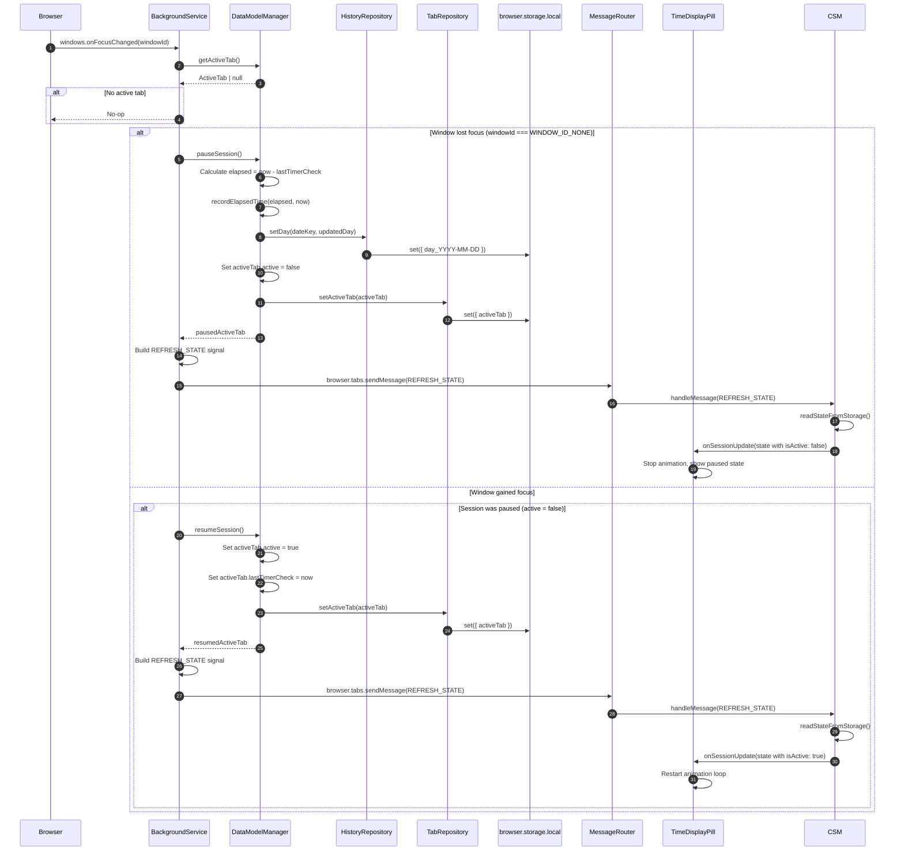

---

## Hour Boundary (HOUR_ELAPSED)

When the clock crosses an hour boundary:

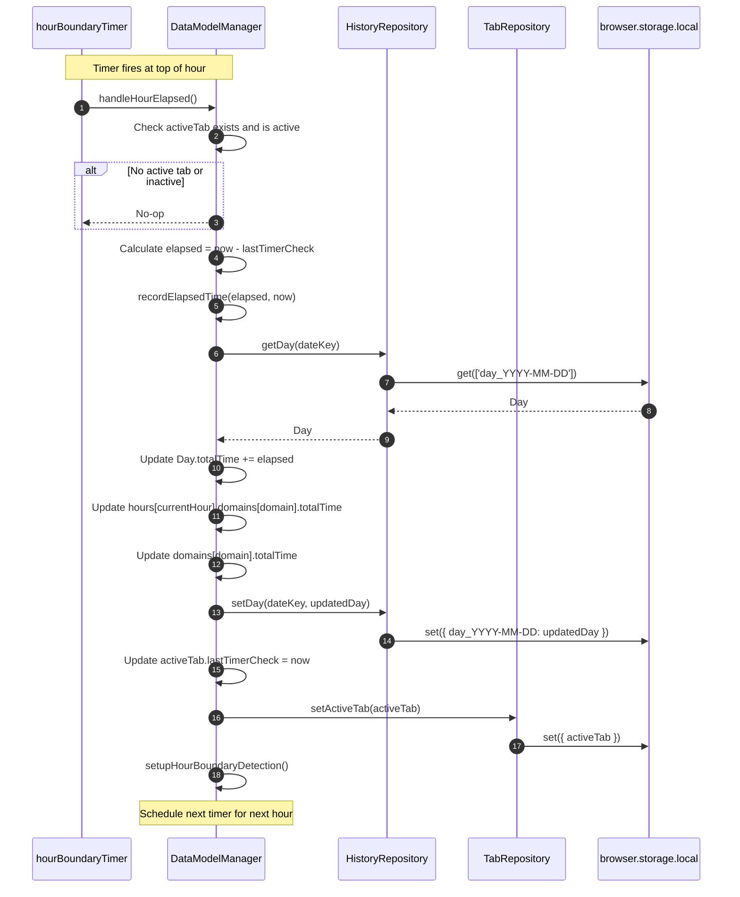

---

## Day Boundary (DAY_ELAPSED)

When the clock crosses midnight:

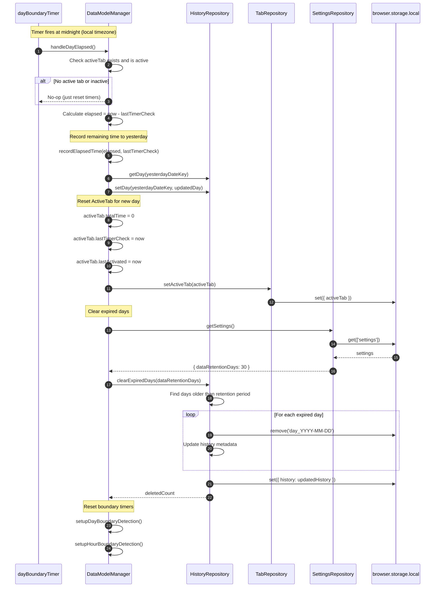

---

## SPA Navigation (Single Page App)

When URL changes within a single-page application:

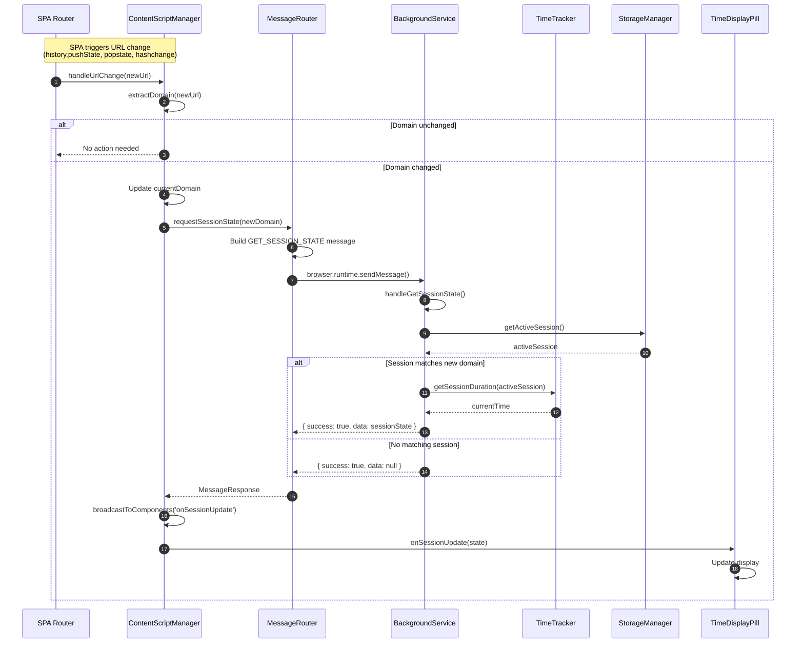

---

## Initial Content Script Load

When a content script initializes on page load:

> **Architecture Decision:** Content scripts use shared repositories for direct storage access, eliminating dependency on background service. See [ADR-0002: Shared Storage Layer](adr/0002-shared-storage-layer.md).

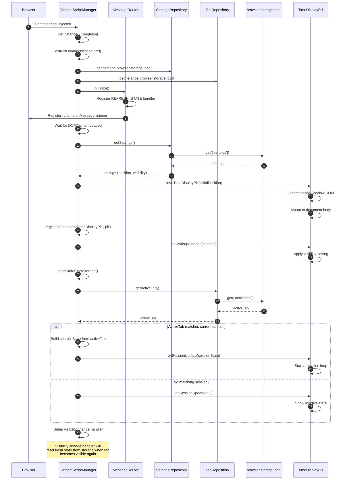

**Direct Storage Access:**

Content scripts read state directly from `browser.storage.local` via shared repositories. This eliminates the need for retry logic since storage is always available, even when the background service worker is suspended.

---

## State Refresh Signal (Signal-Based)

> **Architecture Decision:** Background sends lightweight `REFRESH_STATE` signals. Content scripts read data from storage via repositories. See [ADR-0002](adr/0002-shared-storage-layer.md).

When state changes, background signals content scripts to refresh from storage:

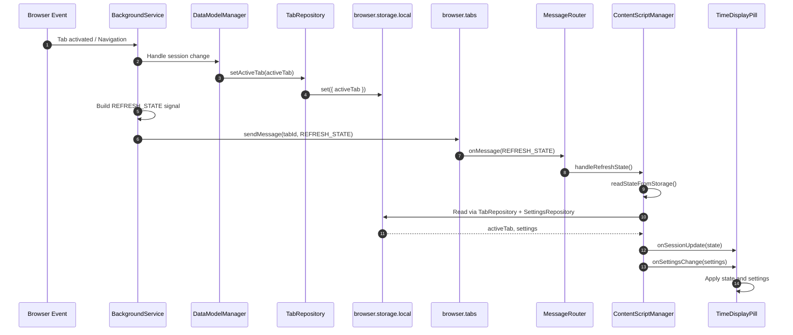

---

## Cross-Tab Position Sync

When a user drags the pill in one tab, the position syncs to other tabs:

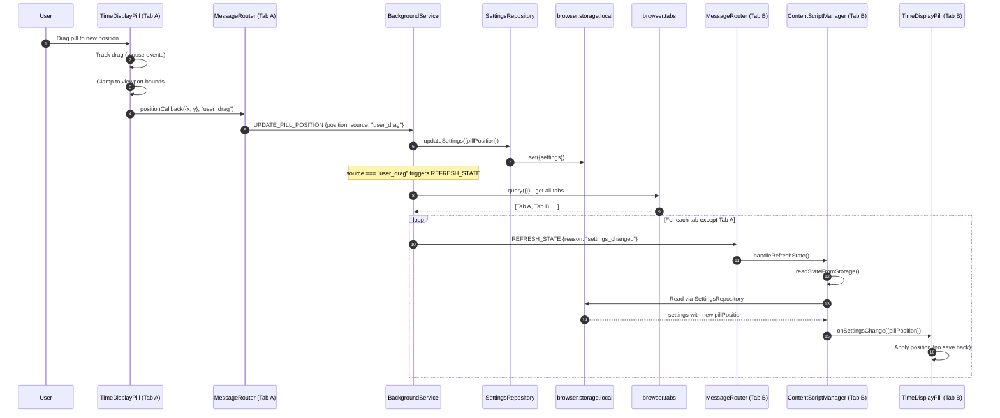

---

## Window Resize Position Clamp

When the window resizes, the pill position is clamped without cross-tab broadcast:

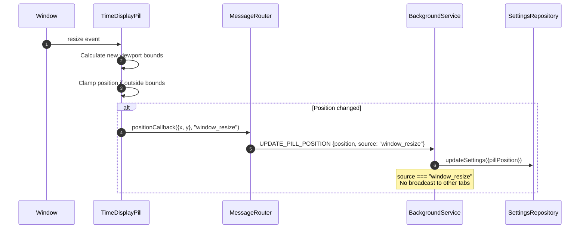

---

## Error Reporting

When a content script encounters an error:

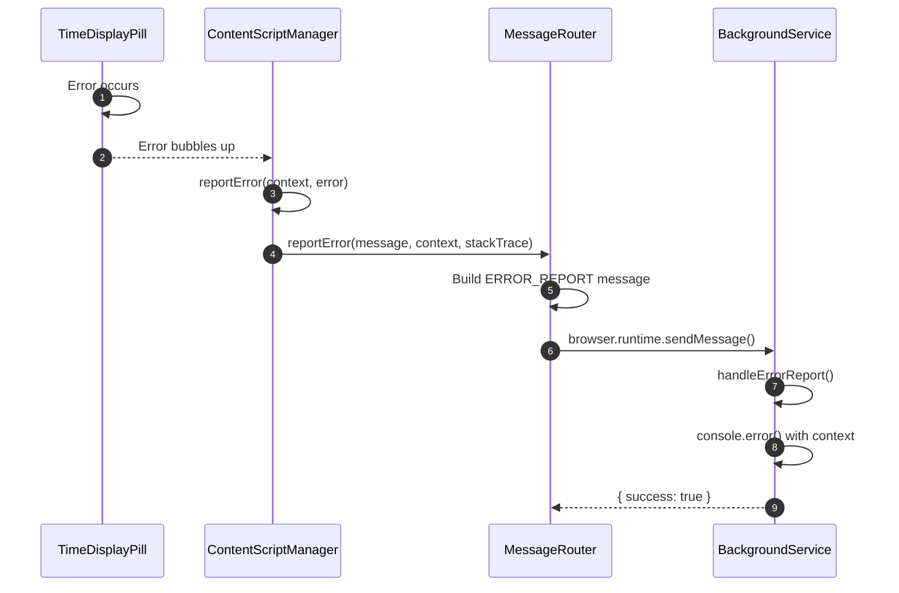

---

## Summary: Event → Component Flow

| Trigger | Event | Handler | Lifecycle | Result |
|---------|-------|---------|-----------|--------|
| Tab switch | `tabs.onActivated` | BackgroundService → DataModelManager | TAB_EXIT → TAB_ENTER | Record time → Start new → Send REFRESH_STATE |
| URL change | `tabs.onUpdated` | BackgroundService → DataModelManager | TAB_EXIT → TAB_ENTER | Record time → Start new → Send REFRESH_STATE |
| Navigation complete | `webNavigation.onCompleted` | BackgroundService → DataModelManager | TAB_EXIT → TAB_ENTER | Record time → Start new → Send REFRESH_STATE |
| Window focus lost | `windows.onFocusChanged` | BackgroundService → DataModelManager | pauseSession() | Record time → Set inactive → Send REFRESH_STATE |
| Window focus gained | `windows.onFocusChanged` | BackgroundService → DataModelManager | resumeSession() | Set active → Send REFRESH_STATE |
| Hour boundary | `setTimeout` | DataModelManager | HOUR_ELAPSED | Record time → Reset checkpoint |
| Day boundary | `setTimeout` | DataModelManager | DAY_ELAPSED | Record time → Reset totals → Clear expired |
| SPA navigation | `popstate`/`pushState` | ContentScriptManager | Read storage | Read state from repositories → Update pill |
| Tab visibility | `visibilitychange` | ContentScriptManager | Read storage | Read fresh state from repositories → Update pill |
| Page unload | `beforeunload` | ContentScriptManager | Cleanup | Destroy components → Cleanup |
| User drags pill | `mouseup` | TimeDisplayPill → BackgroundService | UPDATE_PILL_POSITION | Save position → Send REFRESH_STATE (excl. origin) |
| Window resize | `resize` | TimeDisplayPill → BackgroundService | UPDATE_PILL_POSITION | Save position (no broadcast) |
