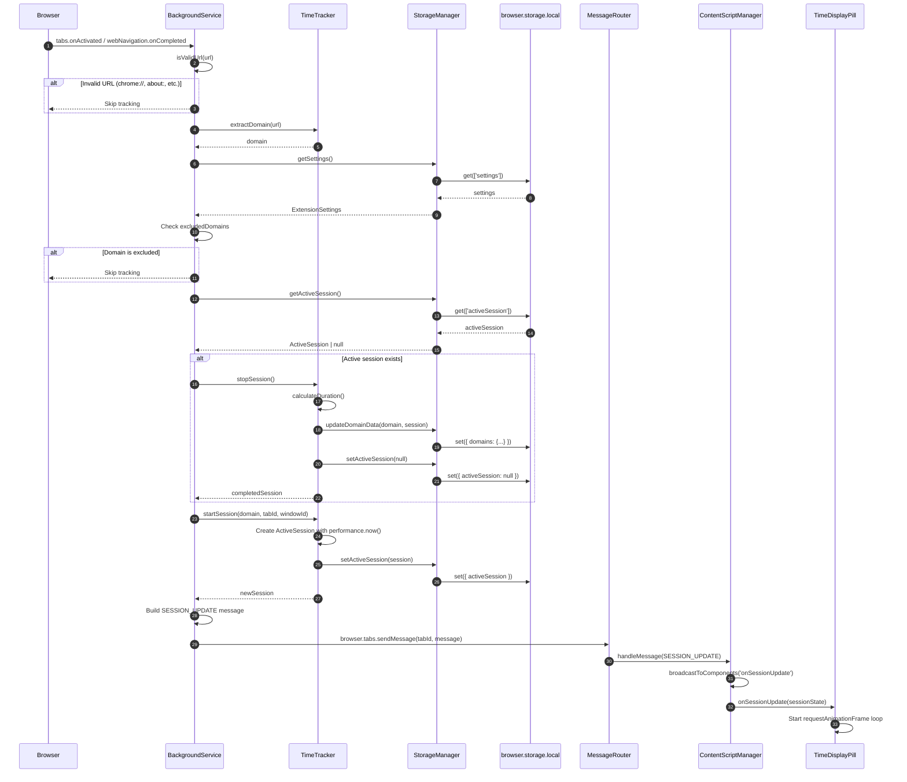
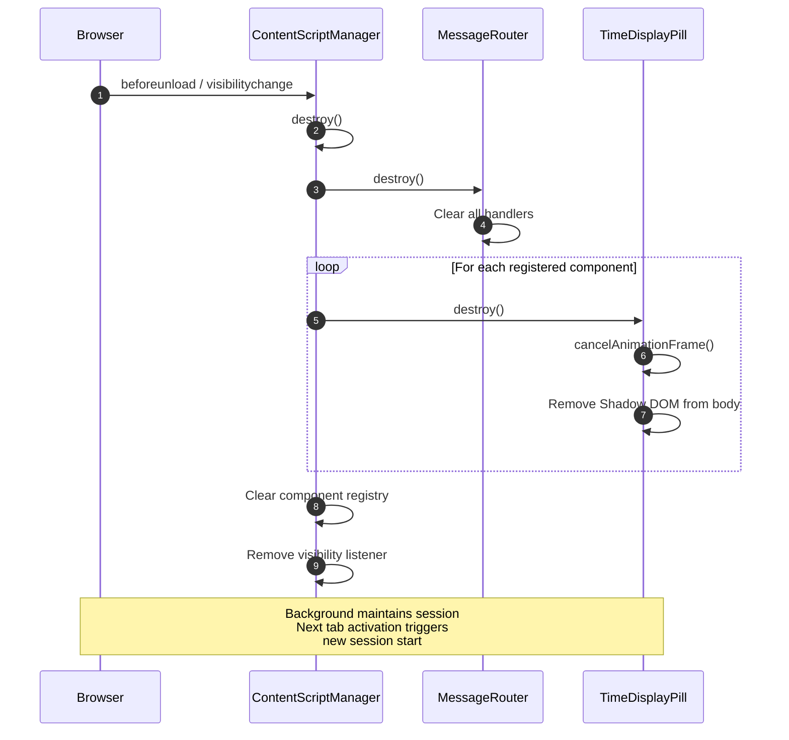
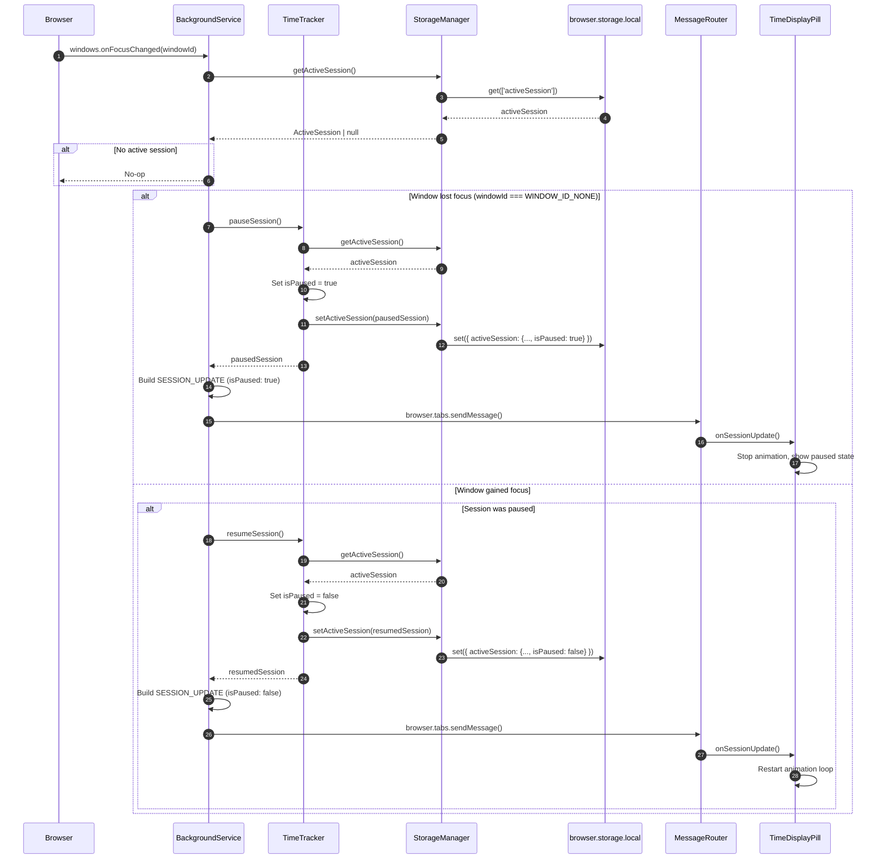
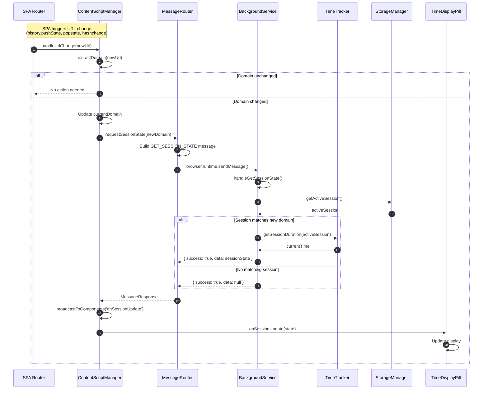
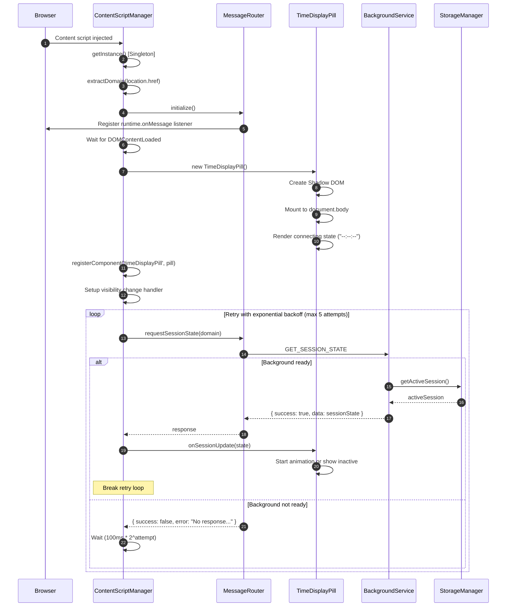
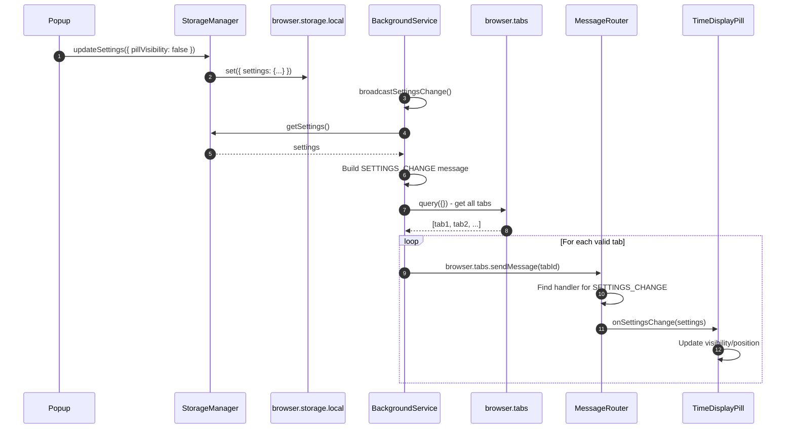
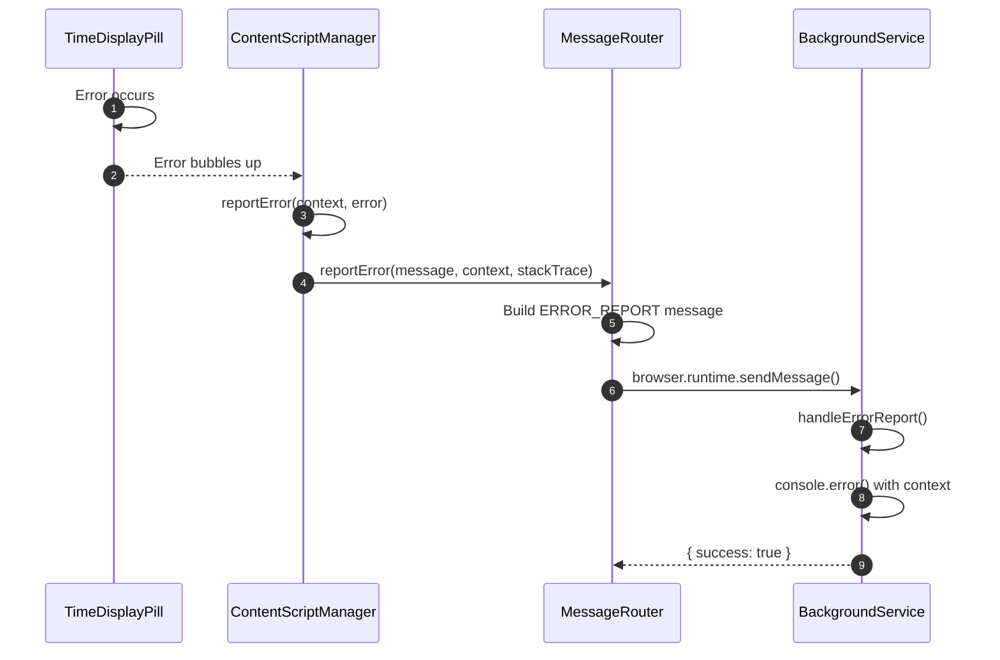

# Web Time Tracker - Sequence Diagrams

This document shows the detailed sequence of events for key operations in the Web Time Tracker extension.

## Tab Load / Navigation

When a user navigates to a new page or activates a tab:

---

## Tab Unload / Page Navigation Away

When a user navigates away or closes a tab:

---

## Window Focus Change

When the browser window gains or loses focus:

---

## SPA Navigation (Single Page App)

When URL changes within a single-page application:

---

## Initial Content Script Load

When a content script initializes on page load:

---

## Settings Change Broadcast

When settings are updated (future feature):

---

## Error Reporting

When a content script encounters an error:

---

## Summary: Event → Component Flow

| Trigger | Event | Handler | Result |
|---------|-------|---------|--------|
| Tab switch | `tabs.onActivated` | BackgroundService | Stop old session → Start new → Broadcast |
| URL change | `tabs.onUpdated` | BackgroundService | Stop old session → Start new → Broadcast |
| Navigation complete | `webNavigation.onCompleted` | BackgroundService | Stop old session → Start new → Broadcast |
| Window focus | `windows.onFocusChanged` | BackgroundService | Pause/Resume → Broadcast |
| SPA navigation | `popstate`/`pushState` | ContentScriptManager | Request session state → Update pill |
| Tab visibility | `visibilitychange` | ContentScriptManager | Request fresh state → Update pill |
| Page unload | `beforeunload` | ContentScriptManager | Destroy components → Cleanup |
